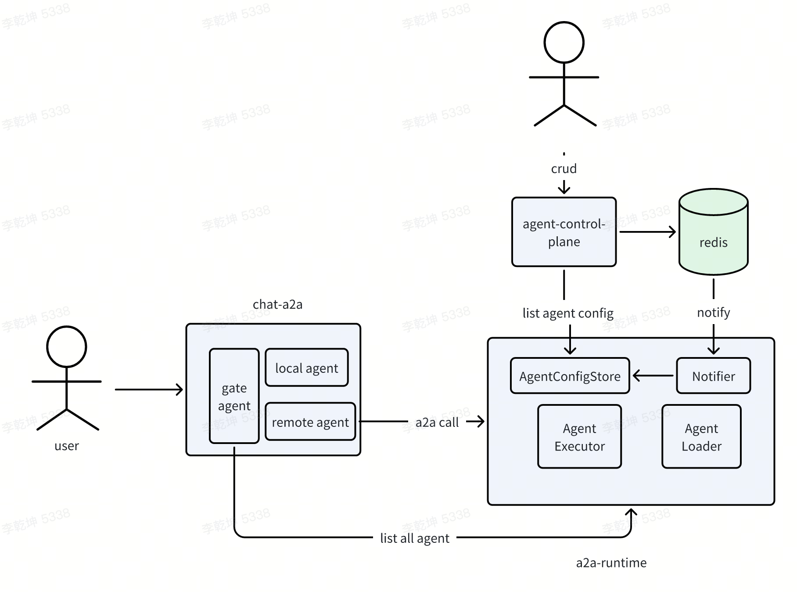
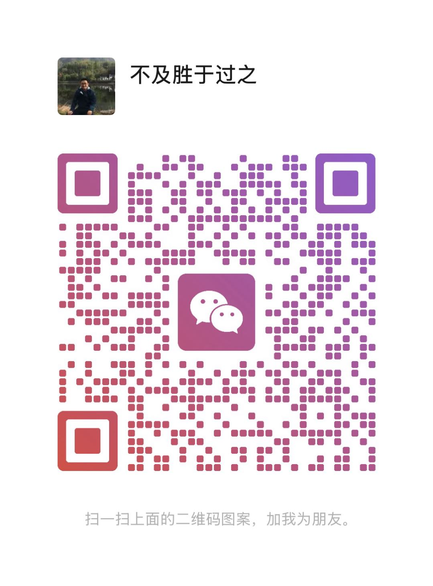

# 简介

chat-a2a 是一个支持a2a协议的multiagent 问答服务。 项目特点

1. 原生multiagent 理念来设计问答系统，区分gate_agent和agent
    1. gate_agent 负责接收用户问题，将问题分发给不同的agent
    2. agent回答用户问题，分为local agent 和remote agent 两种形式
2. 基于A2A来访问remote Agent，与[a2a-runtime](https://github.com/qiankunli/a2a-runtime) 配合使用

# 特性

## 原生multiagent 理念

原生multiagent 体现在

1. chat-a2a 只负责通过gate-agent(plan) 编排remote agent回答问题（也可以在chat-a2a中实现local agent），自身并不负责直接回答问题。
   1. 默认采用plan ==> remote agent ==> plan ==> ... ==> report 链路来回答问题
   2. chat-a2a负责维护回话、用户（还未加）、聊天等数据，remote agent 只负责根据输入给出输出即可（可以考虑接入mcp），理论上无需再访问db等。
3. agent问答记录直接存在message表中，地位与用户问题、最终答案相同。

   |id|conv_id|task_id|role|type|content|agent|
   |---|---|---|---|---|---|---|
   |1|conv1|task1|user||天气如何||
   |2|conv1|task1|agent|query|天气如何|plan|
   |3|conv1|task1|agent|input_required|您问到哪里的天气|weather|
   |4|conv1|task1|user||上海||
   |5|conv1|task1|agent|query|上海天气如何|plan|
   |6|conv1|task1|agent|answer|上海天气很热|weather|
   |7|conv1|task1|assistant||上海天气很热||

## 关于反问的处理

支持反问相关设计如下

1. 子agent 反问通过input_required 来表达，这也是a2a推荐的方式
2. 反问场景下，用户两次输入的问题属于同一个task_id(a2a中的概念)
3. 用户/前端和gate_agent 并不感知某条agent 输出是否是反问，而是根据message表跟踪agent 执行记录。这样做可以让gate_agent
   无需引入类似langgraph checkpoint机制 ，更灵活一些。

如果用户在反问场景下，直接输入新问题，则仍沿用之前的task_id 会有问题，后续会继续优化。

# 联系我

项目仍不完善，欢迎共创

